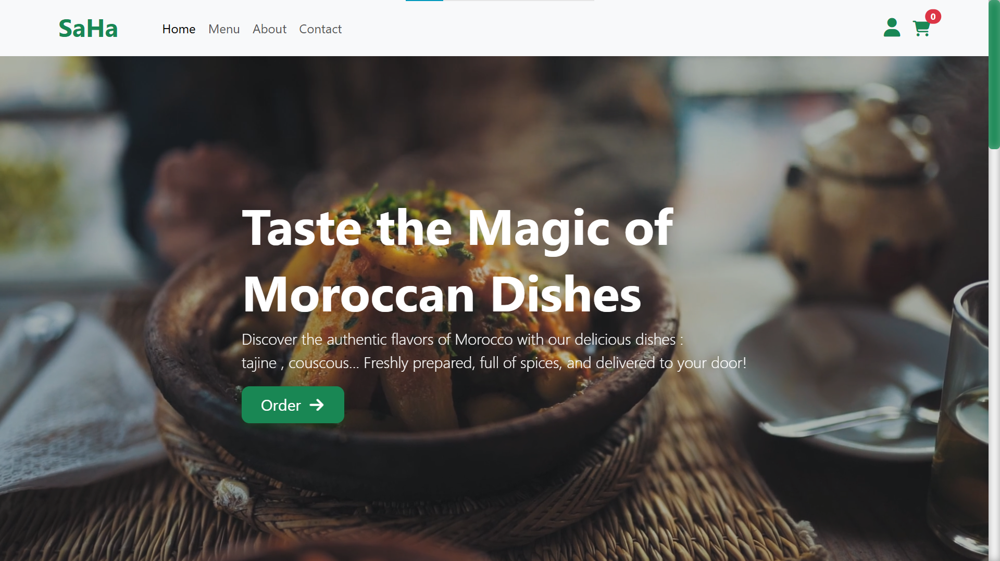
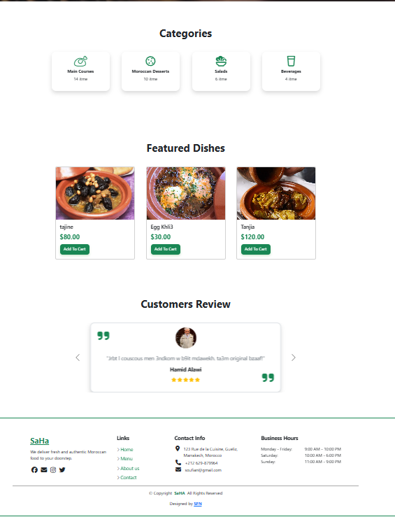
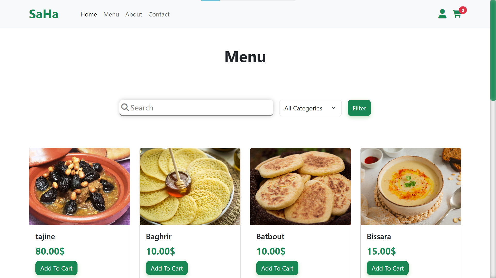
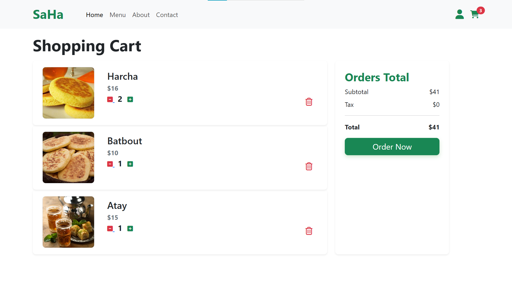
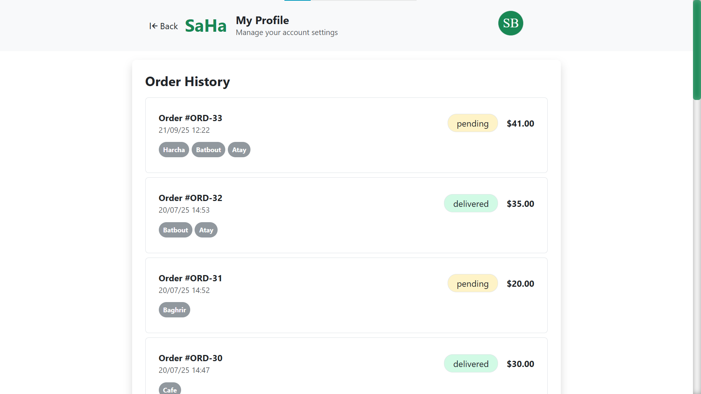
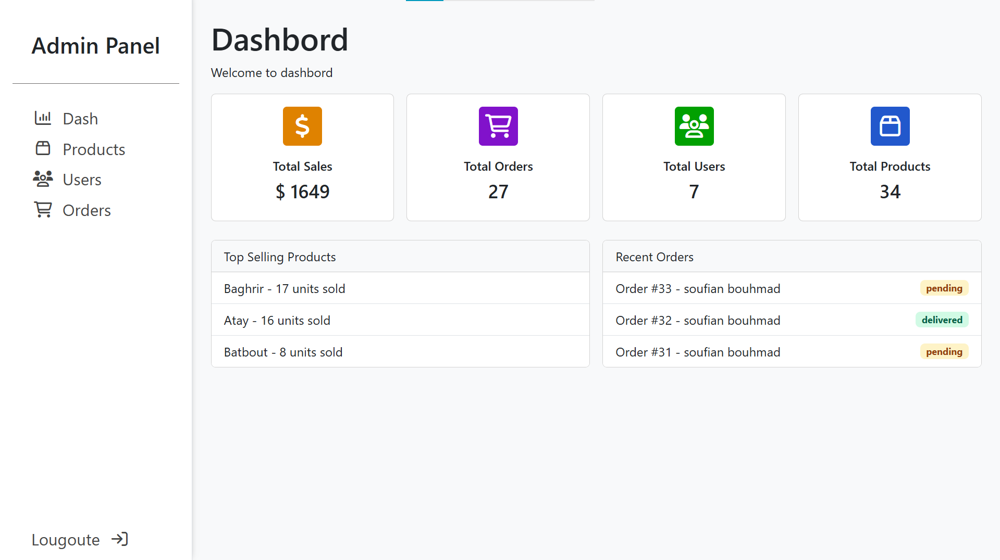

# SaHA – Moroccan Cuisine Restaurant Web Application

SaHA is a modern web application for a Moroccan cuisine restaurant, offering a seamless experience for customers and administrators. Customers can browse the menu, place orders, and manage their profiles, while admins can manage products, users, and orders through a dedicated dashboard.

---

## 📸 Screenshots

### Home Page



### Menu Page


### Cart


### User Orders


### Admin Dashboard


---

## 🗂️ Project Structure

```
SaHA/
├── admin/               # Admin dashboard and management pages
│   ├── dashboard.php
│   ├── manage_products.php
│   ├── manage_users.php
│   └── manage_orders.php
├── css/                 # Stylesheets (Bootstrap, custom styles)
│   ├── style.css
│   └── adminstyle.css
├── images/              # Product and UI images
├── includes/            # Shared PHP includes (header, footer, functions, SQL)
│   ├── header.php
│   ├── footer.php
│   ├── functions.php
│   └── maroccan.sql
├── media/               # Media files (e.g., videos)
├── profile/             # User profile and order history
│   └── profile.php
├── screenshots/         # Screenshots for documentation
├── index.php            # Home page
├── menu.php             # Menu and product listing
├── cart.php             # Shopping cart
├── checkoute.php        # Checkout process
├── logine.php           # Login page
├── signup.php           # Signup page
├── welcom.php           # Welcome page after signup
├── about.php            # About the restaurant
├── contact.php          # Contact form
└── README.md            # Project documentation
```

---

## 🚀 Features

### For Customers
- **Browse Menu:** Explore dishes by category with images, prices, and descriptions.
- **Add to Cart :** Simple cart management
- **User Authentication:** Sign up, log in, and manage your account.
- **Profile Management:** View and update personal info and order history.
- **Responsive Design:** Works on desktop and mobile devices.

### For Admins
- **Dashboard:** Overview of sales, orders, users, and products.
- **Product Management:** Add, edit, and remove menu items.
- **User Management:** View and manage users.
- **Order Management:** Track and update order statuses.

---

## 🛠️ Tech Stack

- **Frontend:** HTML, CSS (Bootstrap), JavaScript (jQuery)
- **Backend:** PHP (PDO)
- **Database:** MySQL
- **Icons:** FontAwesome

---

## ⚡ Getting Started

### Prerequisites

- PHP 8.x
- MySQL/MariaDB
- Apache/Nginx (XAMPP recommended for Windows)

### Installation

1. **Clone the repository:**
   ```sh
   git clone https://github.com/B-Soufian/SaHa-Web.git
   cd SaHa-Web
   ```

2. **Database Setup:**
   - Import `includes/maroccan.sql` into your MySQL database.

3. **Configure Database Connection:**
   - Edit `includes/functions.php` with your DB credentials.

4. **Run the Application:**
   - Place the project in your web server's root directory (e.g., `htdocs` for XAMPP).
   - Access via `http://localhost/SaHA/`.

### Default Admin Account

- **Email:** `admin@gmail.com`
- **Password:** `admin@105`

---

## 📝 Customization

- **Styles:** Edit `css/style.css` and `css/adminstyle.css`.
- **Images:** Update images in the `images/` directory.
- **Business Info:** Edit `includes/footer.php`.

---

## 📄 License

This project is for educational purposes. For commercial use, contact the author.

---

**Designed and developed by [SOUFIAN](https://www.instagram.com/soufian._0/).**

---

_For questions or contributions, open an issue or pull request._
